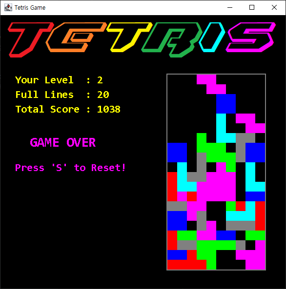
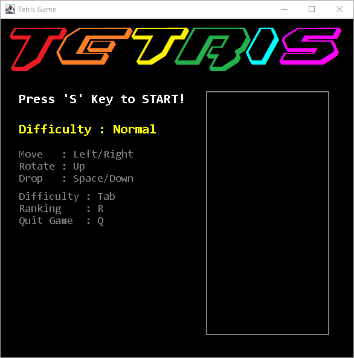
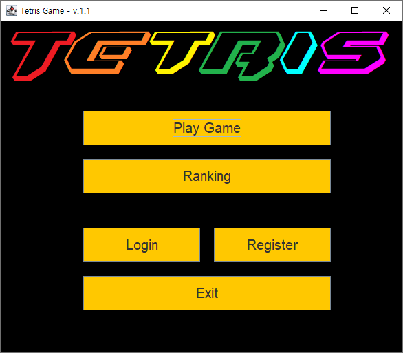
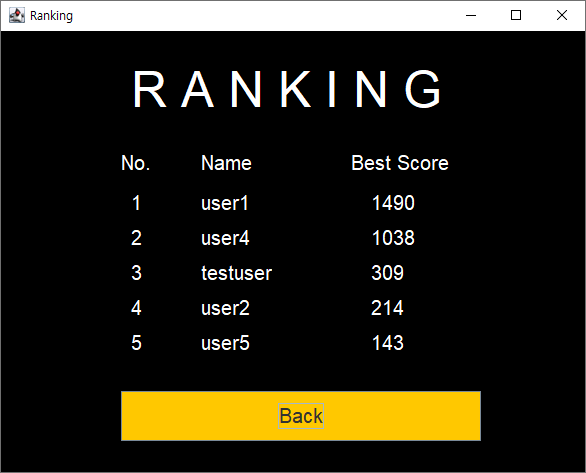
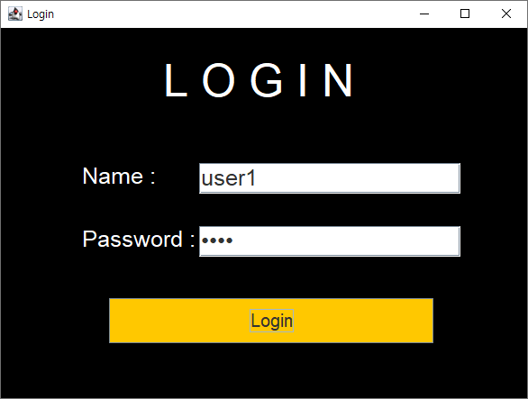
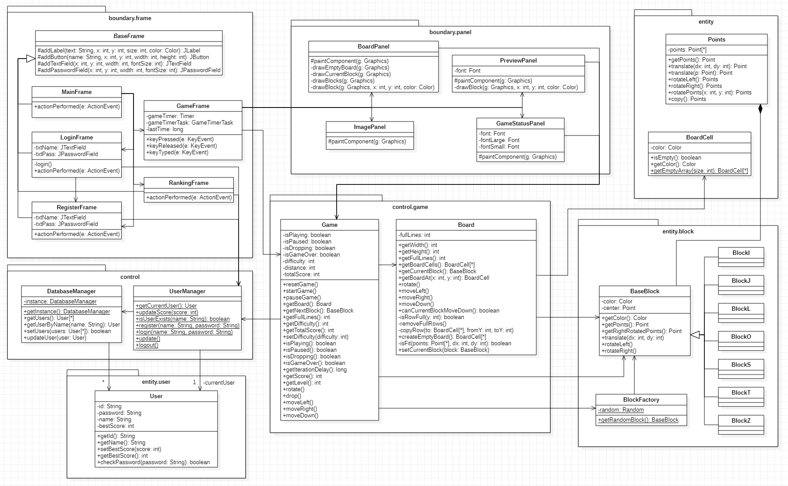

# Tetris-Game

자바로 구현한 객체지향 테트리스 게임입니다.

An object-oriented Tetris game implemented in Java.

## Features
- Basic Tetris Game
- Difficulty Control
- Ranking
- Login/Register (for Ranking) 

---
## Screenshots

 

More screenshots

 

---
## UML

---
## License
[MIT License](./LICENSE)
